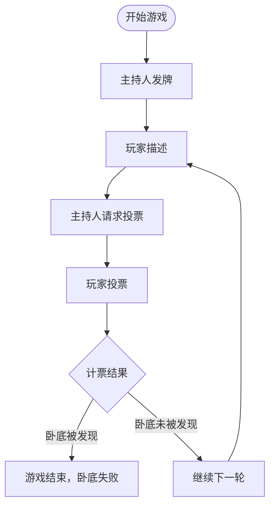
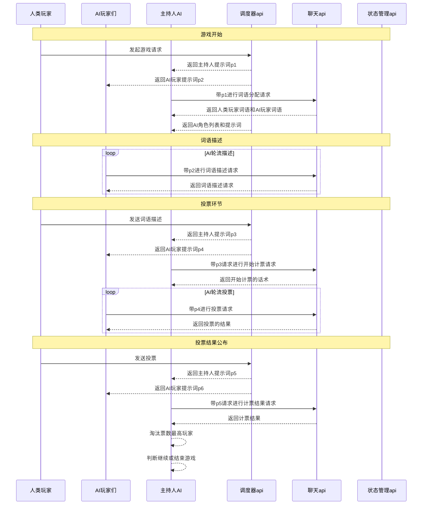

# 《谁是卧底》游戏群

```mermaid
graph TD
A([开始游戏]) --> B[主持人发牌]
    B --> C[玩家描述]
    C --> D[主持人请求投票]
    D --> E[玩家投票]
    E --> F{计票结果}
    F -->|卧底被发现| G[游戏结束，卧底失败]
    F -->|卧底未被发现| H[继续下一轮]
    H --> C
```

```mermaid
sequenceDiagram
    participant Human as 人类玩家
    participant AIs as AI玩家们
    participant Host as 主持人AI
    participant Scheduler as 调度器api
    participant ChatAPI as 聊天api
    participant GameState as 状态管理api

    Note over Human,GameState: 游戏开始
    Human->>Scheduler: 发起游戏请求
    Scheduler-->>Host: 返回主持人提示词p1
    Scheduler-->>AIs: 返回AI玩家提示词p2
    Host->>ChatAPI: 带p1进行词语分配请求
    ChatAPI-->>Host: 返回人类玩家词语和AI玩家词语
    Scheduler-->>Host: 返回AI角色列表和提示词

    Note over Human,GameState: 词语描述
    loop AI轮流描述
        AIs->>ChatAPI: 带p2进行词语描述请求
        ChatAPI-->>AIs: 返回词语描述请求
    end
    
    Note over Human,GameState: 投票环节
    Human->>Scheduler: 发送词语描述
    Scheduler-->>Host: 返回主持人提示词p3
    Scheduler-->>AIs: 返回AI玩家提示词p4
    Host->>ChatAPI: 带p3请求进行开始计票请求
    ChatAPI-->>Host: 返回开始计票的话术
    loop AI轮流投票
        AIs->>ChatAPI: 带p4进行投票请求
        ChatAPI-->>AIs: 返回投票的结果
    end
    Note over Human,GameState: 投票结果公布
    Human->>Scheduler: 发送投票
    Scheduler-->>Host: 返回主持人提示词p5
    Scheduler-->>AIs: 返回AI玩家提示词p6
    Host->>ChatAPI: 带p5请求进行计票结果请求
    ChatAPI-->>Host: 返回计票结果
    Host-->>Host: 淘汰票数最高玩家
    Host-->>Host: 判断继续或结束游戏
```